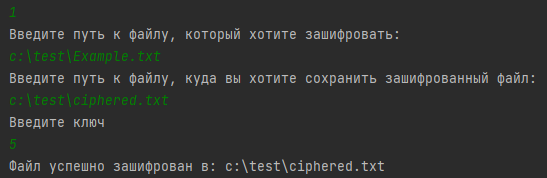
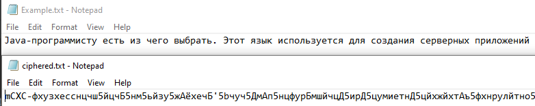
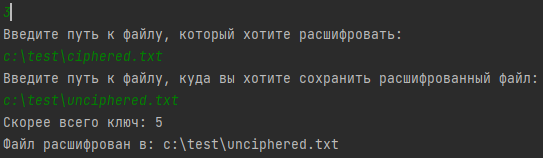
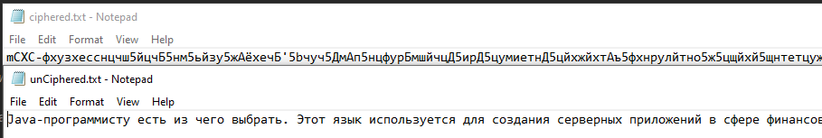

Программа Шифт Цезаря.

Сделана как проект первого модуля JavaRush University.

1. Режим зашифровки (Нужно ввести путь где находится файл с текстом, путь куда сохранить зашифрованный текст и ключ)
2. Режим рассшифровки (Нужно ввести путь где нахоидится файл с зашифрованным текстом, путь куда сохранить расшифрованный текст и ключ)
3. Режим расшифровки с помощью метода BruteForce(Нужно ввести путь где нахоидится файл с зашифрованным текстом, путь куда сохранить расшифрованный текст)

BruteForce ищет самый повторяемый символ в тексте. В большинстве текстом это пробел. Если в вашем тексте это не так, то  расшифровать файл правильно без ключа не получится.

Пример работы программы:  

jar файл программы в директории out -> artifacts 

PS Для менторов: 
jar файл "из коробки" на виндовс запустить не получилось, гугл пишет что надо устанавливать программу "Java", чем не стал заниматься.
Путь вводить можно абсолютный или относительный, так что должно работать на любой OC.

live code review естественно проводить можно, сильно не ругайте)
